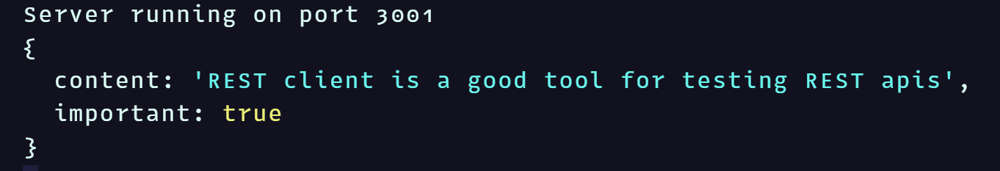
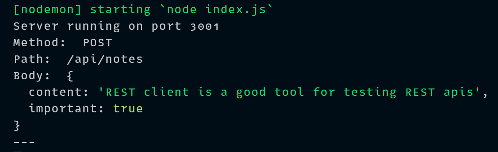

# Node.js and Express

- [Node.js and Express](#nodejs-and-express)
  - [Simple Web Server](#simple-web-server)
  - [Expess](#expess)
  - [Web and Express](#web-and-express)
  - [Nodemon](#nodemon)
  - [REST](#rest)
  - [Fetching a Single Resource](#fetching-a-single-resource)
  - [Deleting Resources](#deleting-resources)
  - [Postman](#postman)
  - [The Visual Studio Code REST Client](#the-visual-studio-code-rest-client)
  - [Receiving Data](#receiving-data)
  - [Middleware](#middleware)

- Make a folder

```sh
mkdir backend && cd backend
npm init
```

- Create index.js file with below content:

```sh
echo "console.log('hello world')" > index.js
```

- Add script to package.json:

```json
"start": "node index.js"
```

- We can run the program directly:

```sh
node index.js
```

- Or we can run it as:

```sh
npm start
```

## Simple Web Server

Let's change the app into a web server:

```js
const http = require("http") // Node's built-in web server module

const app = http.createServer((req, res) => {
  res.writeHead(200, { "Content-Type": "text/plain" })
  res.end("Hello World")
})

const PORT = 3001
app.listen(PORT)
console.log(`Server running on port ${PORT}`)
```

- run **`npm start`** to start the server & visit http://localhost:3001
- The address http://localhost:3001/foo/bar will display the same content.

To serve raw data in the JSON format to the frontend we can do this:

```js
const http = require("http")

let notes = [
  {
    id: 1,
    content: "HTML is easy",
    date: "2019-05-30T17:30:31.098Z",
    important: false,
  },
  ...
]

const app = http.createServer((req, res) => {
  res.writeHead(200, { "Content-Type": "application/json" })
  res.end(JSON.stringify(notes))
})

const PORT = 3001
app.listen(PORT)
console.log(`Server running on port ${PORT}`)
```

## Expess

**Express** is an interface to work with built-in **http** module. It provides a better abstraction for general use cases we usually require to build a backend server.

```sh
npm install express
```

- To update the dependencies of our project we can:

```sh
npm update
```

## Web and Express

```js
const express = require('express')
const app = express()

let notes = [
  ...
]

app.get('/', (request, response) => {
  response.send('<h1>Hello World!</h1>')
})

app.get('/api/notes', (request, response) => {
  response.json(notes)
})

const PORT = 3001
app.listen(PORT, () => {
  console.log(`Server running on port ${PORT}`)
})
```

We define two *routes* to the app. The event handler function accepts two parameters: **`request`** and **`response`**. **`request`** contains all of the info of the HTTP request, **`response`** parameters is used to define how the request is responded to.

The request to the app's root (**`/`**) is answered by using the **`send`** method of the **`response`** object. Server responds with the string **`<h1>Hello World!</h1>`**, that was passed to the **`send`** method. Since the parameter is a string, express automatically sets the value of the **`Content-Type`** header to be **`text/html`**. The status code of the response defaults to **`200`**.


The second route defines an event handler, that handles **HTTP GET** request made to the **_notes_** path of the application.

The request is responded to with the **`json`** method of the **`response`** object. **`Content-Type`** is automatically set to **`application/json`**.

In the earlier version where we were only using Node, we had to transform the data into the JSON format with the **`JSON.stringify`** method.

```js
response.end(JSON.stringify(notes))
```

With Express, this transformation happens automatically.

## Nodemon

> nodemon will watch the files in the directory in which nodemon was started, and if any files change, nodemon will autumatically restart your node application.

```sh
npm install --save-dev nodemon
```

We can start our application with **_nodemon_** like this:

```sh
node_modules/.bin/nodemon index.js
```

Even though the backend server restarts automatically, the browser still has to be manually refreshed.

Let's define a dedicated **_npm script_** for it in the **_package.json_** file:

```json
"scripts": {
  "start": "node index.js",
  "dev": "nodemon index.js",
}
```

Start the server in the dev mode:

```sh
npm run dev
```

## REST

Singular things, like notes, persons, tasks, are called **_resources_** in RESTful thinking. Every resource has an associated URL, which is the resource's unique address.

One convention is to create the unique address for the resources by combining the name of the resource type with the resource's unique identifier.

If the root URL of our service is **_www.example.com/api_** & we define the resource type of notes to be **_note_**, then the address of a note resource with the identifier 10, has the unique address **_www.example.com/api/notes/10_**.

The URL for the entire collection of note resources is **_www.example.com/api/notes_**.

We can execute different operations on resources. The operation to be executed is defined by the HTTP verb:


| URL            | Verb         | Functionality                                                    |
| -------------- | ------------ | ---------------------------------------------------------------- |
| **`notes/10`** | **`GET`**    | fetches a single resource                                        |
| **`notes`**    | **`GET`**    | fetches all resources in the collection                          |
| **`notes`**    | **`POST`**   | creates a new resource based on the request data                 |
| **`notes/10`** | **`DELETE`** | removes the identified resource                                  |
| **`notes/10`** | **`PUT`**    | replaces the entire identified resource with the request data    |
| **`notes/10`** | **`PATCH`**  | replaces a part of the identified resource with the request data |

## Fetching a Single Resource

- Let's create a route for fetching a single resource

```js
app.get("/api/notes/:id", (req, res) => {
  const id = req.params.id
  const note = notes.find((note) => note.id === id)
  res.json(note)
})
```

- Now **`app.get("api/notes/:id", ...)`** will handle all HTTP GET requests, that are of the form **_/api/notes/SOMETHING_**, where *SOMETHING* is an arbitrary string.

- The **_id_** parameter in the route of a request, can be accessed through the **`req`** object:

```js
const id = request.params.id
```

- **`find`** method of arrays is used to find the note with an id that matches the parameter. The note is then returned to the sender of the request.

- When we test our app by visiting http://localhost:3001/api/notes/1, we notice that it does not appear to work, as the browser displays an empty page.

- Let's debug using **`console.log()`**:

```js
app.get("/api/notes/:id", (req, res) => {
  const id = req.params.id
  console.log(id)
  const note = notes.find((note) => note.id === id)
  console.log(note)
  res.json(note)
})
```

- When we revisit http://localhost:3001/api/notes/1, the console which is the terminal in this case, will display the following:


- The **`id`** parameter from the route is passed to our app but the **`find`** method does not find a matching note.

- To further our investigation, we can also add a **`console.log`** inside the comparison function passed to the **`find`** method.

```js
app.get("/api/notes/:id", (req, res) => {
  const id = req.params.id
  const note = notes.find((note) => {
    console.log(note.id, typeof note.id, id, typeof id, note.id === id)
    return note.id === id
  })
  console.log(note)
  res.json(note)
})
```

When we visit the URL again, each call to the comparison function prints a few different things to the console.


The **`id`** variable contains a string **`"1"`**, wheres the ids of notes are integers. In JS, the "triple equals" comparison **`===`** considers all values of different types to not be equal by default, meaning that **`1`** is not **`"1"`**.

- Let's fix the issue by changing id parameter from a string into a number:

```js
app.get("/api/notes/:id", (req, res) => {
  const id = Number(req.params.id)
  const note = notes.find((note) => note.id === id)
  res.json(note)
})
```

- Now fetching an individual resource works.


However, there's another problem. If we search for a note with an id that does not exist, the server responds with:


HTTP status code **`200`** means that the response succeeded. But there's no data sent back.

The reason for this is that the **`note`** variable is set to **`undefined`** if no mathing note is found. The situation needs to be handled on the server. If no note is found, the server should respond with the status code **`404`** not found instead of **`200`**.

```js
app.get("/api/notes/:id", (req, res) => {
  const id = Number(req.params.id)
  const note = notes.find((note) => note.id === id)

  if (note) {
    res.json(note)
  } else {
    res.status(404).end()
  }
})
```

Since no data is attached to the response, we use the [status](http://expressjs.com/en/4x/api.html#res.status) method for setting the status, and the [end](http://expressjs.com/en/4x/api.html#res.end) method for responding to the request without sending any data.

```js
res.status(403).end()
res.status(400).send('Bad Request')
res.status(404).sendFile('/absolute/path/to/404.png')
```

We do not actually need to display anything in the browser because REST APIs are interfaces that are intended for programmatic use, and the error status code is all that is needed.

## Deleting Resources

Deletion happens by making an HTTP **`DELETE`** request to the url of the resource:

```js
app.delete("/api/notes/:id", (req, res) => {
  const id = Number(req.params.id)
  notes = notes.filter((note) => note.id !== id)

  res.status(204).end()
})
```

If deleting the resource is successful, meaning that the note exists and it is removed, we respond to the request with the status code **`204`** no content and return no data with the response. We can also respond with **`404`**.

## Postman

**`HTTP GET`** requests are easy to make from the browser. But how do we test the **`delete`** operations? We could write some JS for testing deletion, but this is not always the best solution.

One method is to use a command line program [curl](https://curl.haxx.se/). However it's easier to use Postman.

It's enough to define the url and then select the correct request type (**`DELETE`**).


## The Visual Studio Code REST Client

You can use VS Code [REST client](https://marketplace.visualstudio.com/items?itemName=humao.rest-client) plugin instead of Postman.

- Make a directory at the root of application named **_requests_**. Save all the **REST client** requests in the directory as files that end with the **_.rest_** extension.

- Let's create a new **get_all_notes.http** file and define the request that fetches all notes.


By clicking the **_Send Request_** text, the REST client will execute the HTTP request and response from the server is opened in the editor:


## Receiving Data

We add new notes to the server by making an **`HTTP POST`** request to the address http://localhost:3001/api/notes, and by sending all the info for the new note in the **request body** in the **JSON format**.

In order to access the data easily, we need the help of the express **`json-parser`**, that is taken to use with command **`app.use(express.json())`**.

```js
app.post("/api/notes", (req, res) => {
  const note = req.body
  console.log(note)

  res.json(note)
})
```

The event handler function can access the data from the **`body`** property of the **`req`** object.

Without the **json-parser**, the **`body`** property would be **`undefined`**. The **json-parser** functions so that it takes the JSON data of a request, transforms it into a JS object and then attaches it to the **`body`** property of the **`req`** object before the route handler is called.

For now, the app does not do anything with the received data besides printing it to the console and sending it back in the response.

Let's verify with REST client that the data is actually received by the server:

```json
POST http://localhost:3001/api/notes
content-type: application/json

{
    "content": "REST client is a good tool for testing REST apis",
    "important": true
}
```

We can verify using POSTMAN as well:


The app prints the data that we sent in the request to the console:



The server will not be able to parse the data correctly without the correct value in the header. It won't even try to guess the format of the data, since there's a massive amount of potential ***Content-Types***.

So you need to set **`Content-Type`** correctly.

One benefit that the **REST client** has over **Postman** is that the requests are handily available at the root of the project repo, and they can be distributed to everyone in the dev team. You can also add multiple requests in the same file using **`###`** separators.

```sh
GET http://localhost:3001/api/notes/

###

POST http://localhost:3001/api/notes HTTP/1.1
content-type: application/json

{
  "name": "sample",
  "time": "Wed, 21 Oct 2015 18:27:50 GMT"
}
```

> **Important sidenote:**
> Sometimes when you're debugging, you ma want to find out what headers have been set in the HTTP request.
> One way is through the **`get`** method of the **`request`** object, that can be used for getting the value of a single header. The **`request`** object also has the **`headers`** property, that contains all of the headers of a specific request.
> Problems can occur with the VS REST client if you accidentally add an empty line between the top row and the row specifying the HTTP headers. In this situation, the REST client interprets this to mean that all headers are left empty, which leads to the backend server not knowing that the data it received is in the JSON format.

You'll be able to spot this missing **`Content-Type`** header if at some point in your code you print all of the request headers with the **`console.log(request.headers)`** command.

One we know that the app receives data correctly, it's time to finalize the handling of the request:

```js
app.post("/api/notes", (req, res) => {
  console.log(req.headers)
  const maxId = notes.length > 0 ? Math.max(...notes.map((n) => n.id)) : 0

  const note = req.body
  note.id = maxId + 1 // not recommended

  notes = notes.concat(note)

  res.json(note)
})
```


The current version still has the problem that the HTTP POST request can be used to add objects with arbitrary properties. Let's improve the app by defining that the **`content`** property may not be empty. The **`important`** and **`date`** properties will be given default values. All other properties are discarded:

```js
const generatedId = () => {
  const maxId = notes.length > 0 ? Math.max(...notes.map((note) => note.id)) : 0
  return maxId + 1
}

app.post("/api/notes", (req, res) => {
  const body = req.body

  if (!body.content) {
    return res.status(400).json({
      error: "content missing",
    })
  }

  const note = {
    content: body.content,
    important: body.important || false,
    date: new Date(),
    id: generatedId(),
  }

  notes = notes.concat(note)

  res.json(note)
})
```

If the received data is missing a value for the content property, the server will respond to the request with the status code **`400 bad request`**.

```js
if (!body.content) {
  return response.status(400).json({
    error: 'content missing'
  })
}
```

Notice that calling **`return`** is crucial, because otherwise the code will execute to the very end and the malformed note gets saved to the app.

> It is better to generate timestamps on the server than in the browser, since we can't trust that host machine running the browser has its clock set correctly.

## Middleware

The express **_json-parser_** we took into use earlier is a so called middleware.

Middleware are functions that can be used for handling **`request`** and **`response`** objects.

The **json-parser** takes the raw data from the requests that's stored in the **`request`** object, parses it into a JavaScript object an assigns it to the request object as a new property _body_.

In practice, you can use several middleware at the same time. When you have more than one, they're executed one by one in the order that they were taken into use in express.

Let's implement our own middleware that prints info about every request that is sent to the server.

Middleware is a function that receives three parameters:

```js
const requestLogger = (req, res, next) => {
  console.log("Method: ", req.method)
  console.log("Path: ", req.path)
  console.log("Body: ", req.body)
  console.log("---")
  next()
}
```

At the end of the function body the **`next`** function that was passed as a parameter is called. The **`next`** function yields control to the next middleware.

Middleware are taken into use like this:

```js
app.use(requestLogger)
```

Middleware functions are called in the order that they're taken into use with the express server object's **`use`** method.

Use **json-parser** before **`requestLogger`** middleware, because otherwise **`req.body`** will not be initialized when the logger is executed.

Now let's make a request from the REST client:

```http
POST http://localhost:3001/api/notes
content-type: application/json

{
    "content": "REST client is a good tool for testing REST apis",
    "important": true
}
```

This is what it logs to the console:



Middleware functions have to be taken into use before routes if we want them to be executed before the route event handlers are called. There are also situations where we want to define middleware functions after routes. In practice, this means that we are defining middleware function that are only called if no route handles the HTTP request.

Let's add the following middleware after our routes, that is used for catching requests made to non-existent routes. For these requests, the middleware will return an error message in the JSON format.

```js
const unknownEndpoint = (req, res) => {
  res.status(404).send({ error: "unknown endpoint" })
}

app.use(unknownEndpoint)
```
