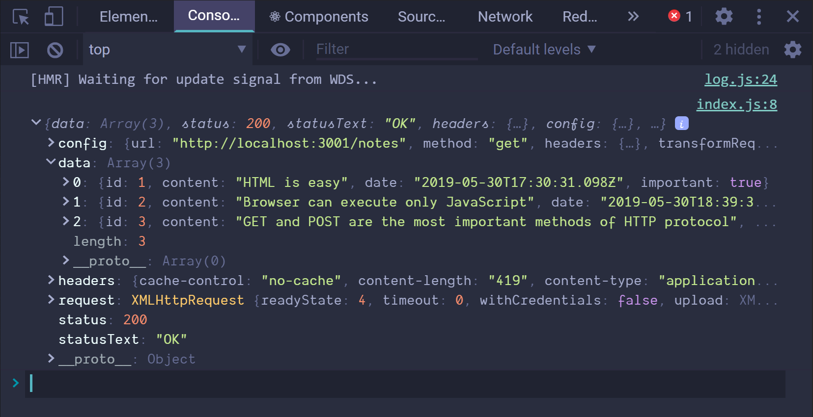
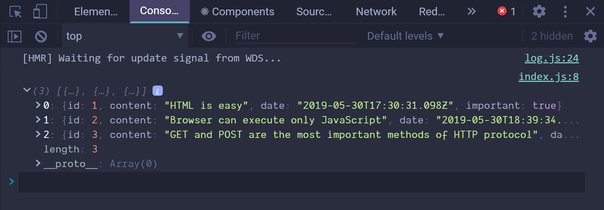

# Notes

- [Notes](#notes)
  - [Getting Data from server](#getting-data-from-server)
    - [Axios and promises](#axios-and-promises)
    - [Effect-hooks](#effect-hooks)
    - [The development runtime environment](#the-development-runtime-environment)
  - [Altering Data in Server](#altering-data-in-server)
    - [REST](#rest)
    - [Sending Data to the Server](#sending-data-to-the-server)
    - [Changing the Importance of Notes](#changing-the-importance-of-notes)
    - [Extracting Communication with the Backend into a Separate Module](#extracting-communication-with-the-backend-into-a-separate-module)
    - [Promises and Errors](#promises-and-errors)

## Getting Data from server

Create a file named **db.json** in the root directory of the project with the following content:

```json
  "notes": [
    {
      "id": 1,
      "content": "HTML is easy",
      "date": "2019-05-30T17:30:31.098Z",
      "important": true
    },
    {
      "id": 2,
      "content": "Browser can execute only JavaScript",
      "date": "2019-05-30T18:39:34.091Z",
      "important": false
    },
    {
      "id": 3,
      "content": "GET and POST are the most important methods of HTTP protocol",
      "date": "2019-05-30T19:20:14.298Z",
      "important": true
    }
  ]
}
```

You can [install JSON server](https://github.com/typicode/json-server#getting-started) globally on your machine using the command **`npm install -g json-server`**.

However, a global installation is not necessary. From the root directory of your app, we can run the **json-server** using the command **`npx`**:

```sh
npx json-server --port 3001 --watch db.json
```

The idea is to save the notes to the server, which in this case means saving to the **`json-server`**. The React code fetches the notes from the server and renders them to the screen . Whenever a new note is added to the application the React code also sends it to the server to make the new note persist in "memory".

**`json-server`** stores all the data in the **`db.json`** file, which resides on the server.

Now let's install **axios**:

```sh
npm install axios --save
```

Let's now install **json-server** as a development dependency by executin the command:

```sh
npm install json-server --save-dev
```

and making an addition to the _scripts_ part of the **_package.json_** file:

```json
{
  // ...
  "scripts": {
    "start": "react-scripts start",
    "build": "react-scripts build",
    "test": "react-scripts test",
    "eject": "react-scripts eject",
    "server": "json-server -p3001 --watch db.json"
  }
}
```

We can now start the **json-server** from the project root directory with the command:

```sh
npm run server
```

### Axios and promises

Add the following to the file **`index.js`**:

```js
import axios from "axios";

const promise = axios.get("http://localhost:3001/notes")
console.log(promise);

const promise2 = axios.get("http://localhost:3001/foobar);
console.log(promise2);
```

This should be printed to the console:


Axios'method **`get`** returns a [promise](https://developer.mozilla.org/en-US/docs/Web/JavaScript/Guide/Using_promises).

> A Promise is an object representing the eventual completion or failure of an asynchronous operation.

In other words, a promise is an object that represents an asynchronous operation. A promise can have three distinct states:

**1. The promise is _pending_**: It means that the final value (one of the following two) is not available yet.
**2. The promise is _fulfilled_**: It means that the operation has completed and the final value is available, which generatlly is a successful operation. This state is sometimes also called **_resolved_**.
**3. The promise is _rejected_**: It means that an error prevented the final value from being determined, which generally represents a failed operation.

The first promise in our example is fulfilled, representing a successful **`axios.get("http://localhost:3001/notes`** request. The second one, however, is **_rejected_**, and the console tells us the reason. We're making an HTTP GET request to a non-existent address.

If, and when, we want to access the result of the operation represented by the promise, we must register an event handler to the promise. This is achieved using the method **`then`**:

```js
const promise = axios.get("http://localhost:3001/notes");

promise.then(res => console.log(res);)
```

The following is printed to the console:



The JavaScript runtime environment calls the callback function registered by the **`then`** method providing it with a **`response`** object as a parameter. The **`response`** object contains all the essential data relalted to the response of an HTTPGET request, which would include the returned **_data, status code,_** and **_headers_**.

Storing the promise object in a variable is generally unnecessary, and it's instead common to chain the **`then`** method call to the axios method call, so that it follow it directly:

```js
axios.get("http://localhost:3001/notes").then((res) => {
  const notes = res.data;
  console.log(notes);
});
```



The data returned by the server is plain text, basically just one long string. The axios library is still able to parse the data into a JavaScript array, since the server specified that the data format is **_application/json; charset=utf-8_** using the **`content=type`** header.

We can now begin using the data fetched from the server.

Let's move the fetchin of the data into the **`App`** component.

### Effect-hooks

> The Effect hook lets you perform side effects in function components. Data fetching, setting up a subscription, and manually changing the DOM in React components are all examples of side effects.

The **`App`** components changes as follows:

```js
import React, { useState, useEffect } from "react";
import axios from "axios";
import Note from "./components/Note";

const App = () => {
  const [notes, setNotes] = useState([]);
  const [newNote, setNewNote] = useState("");
  const [showAll, setShowAll] = useState(true);

  useEffect(() => {
    console.log(effect);
    axios.get("http:localhost:3001/note").then((res) => {
      console.log("promise fulfilled");
      setNotes(res.data);
    });
  }, []);
  console.log("render", notes.length, "notes");
  ...
};
```

Let's rewrite the code a bit differently:

```js
const hook = () => {
  console.log("Effect");
  axios.get("http://localhost:3001/notes").then((res) => {
    console.log("promise fulfilled");
    setNotes(res.data);
  });
};

useEffect(hook, []);
```

Now we can see more clearly that the function [**`useEffect`**](https://reactjs.org/docs/hooks-reference.html#useeffect) takes **_two parameters_**. The first is a function, the _effect_ itself.

> By default, effect run after every completed render, but you can choose to fire it only when certain values have changed.

By default the effect is **_always_** run after the component has been rendered. In our case, however, we only want to execute the effect along with the first render.

The second parameter of **`useEffect`** is used to specify how often the effect is run. If the second paramter is an empty array **`[]`**, then the effect is only run along with the first render of the component.

Note that we could have also written the code of the effect function this way:

```js
useEffect(() => {
  console.log("effect");

  const eventHandler = (res) => {
    console.log("promise fulfilled");
    setNotes(res.data);
  };

  const promise = axios.get("http://localhost:3001/notes");
  promise.then(eventHandler);
}, []);
```

We still have a problem in our app. When adding new notes, they are not stored on the server.

### The development runtime environment

The following image describes the makeup of the app:


## Altering Data in Server

### REST

In REST terminology, we refer to individual data objects, such as the notes in our application, as **_resources_**. Every resource has a unique address associated with it - it's URL. According to a general convention used by json-server, we would be able to locate an individual note at the resource URL **_notes/3_**, where **`3`** is the **`id`** of the resource. The **_notes_** url, on the other hand, would point to a resource collection containing all the notes.

Resources are fetched from the server with **HTTP GET** request. For instance, an HTTP GET request to the URL **_notes/3_** will return the note that has the id number 3. An HTTP GET request to the **_notes_** URL would return a list of all notes.

Creating a new resource for storing a note is done by making an **HTTP POST** request to the **_notes_** URL according to the REST convention that the json-server adheres to. The data for the new note resource is sent in the **_body_** of the request.

**json-server** requires all data to be sent in JSON format. What this means in practice is that the data must be a correctly formatted string, and that the request must contain the **`Content-Type`** request header with the value **_application/json_**.

### Sending Data to the Server

Let's make the following changes to the event handler responsible for creating a new note:

```js
const addNote = (e) => {
    e.preventDefault();
    const noteObject = {
      content: newNote,
      date: new Date(),
      important: Math.random() > 0.5,
    };

    axios
      .post("http://localhost:3001/notes", noteObject)
      .then((res) => console.log(res));
    setNewNote("");
  };
```

We create a new object for the note but omit the **`id`** property, since it's better to let the server generate ids for our resources!

The object is sent to the server using the axios **`post`** method. The registered event handler logs the response that is sent back from the server to the console.


The newly created note resource is stored in the value of the **`data`** property of the **`res`** object.

Sometimes it can be useful to inspect HTTP requests in the **_Network_** tab of Chrome dev tools.


We can use the inspector to check that the headers sent in the POST request are what we expected them to be, and that their values are correct.

Since the data we sent in the POST request was a JS object, axios automatically knew to set the appropriate **`application/json`** value for the **`Content-Type`** header.

The new note is not rendered to the screen yet. This is because we did not update the state of the **App** component when we created the new note. Let's fix this:

```js
const addNote = e => {
  e.preventDefault();
  const noteObject = {
    content: newNote,
    date: new Date(),
    important: Math.random() > 0.5,
  }

  axios.post("http://localhost:3001/notes", noteObject).then(res => {
    setNotes(notes.concat(res.data));
    setNewNote("");
  })
}
```

The new note returned by the backend server is added to the list of notes in our application's state in the customary way of using the **`setNotes`** function and then resetting the note create form. An important detail to remember is that the **`concat`** method does not change the component's original state, but instead creates a new copy of the list.

Once the data returned by the server starts to have an effect on the behavior of our web applications, we are immediately faced with a whole new set of challenges arising from, for instance, the asynchronicity of communication.

It's beneficial to inspect the state of the backend server e.g. through the browser:


> NB. In the current version of our app the browser adds the creation date property to the note. Since the clock of the machine running the browser can be wrongly configured, it's much wiser to let the backend server generate this timestamp for us.

### Changing the Importance of Notes

Let's add a button to every note that can be used for toggling it's importance.

```js
const Note = ({note, toggleImportance}) => {
  const label = note.important ? "Make not important" : "Make important";

  return (
    <li>
      {note.content}
      <button onClick={toggleImportance}>{label}</button>
    </li>
  )
}
```

We add a button to the component and assign its event handler as the **`toggleImportance`** function passed in the component's props.

```diff
const App = () => {
  const [notes, setNotes] = useState([]);
  const [newNote, setNewNote] = useState("");
  const [showAll, setShowAll] = useState(true);

  // ...

+ const toggleImportanceOf = (id) => {
+   console.log(`Importance of ${id} needs to be toggled`);
+ };

  // ...

  return (
    <div>
      <h1>Notes</h1>
      <div>
        <button onClick={() => setShowAll(!showAll)}>
          show {showAll ? "important" : "all"}
        </button>
      </div>

      <ul>
        {notesToShow.map((note) => (
          <Note
            key={note.id}
            note={note}
+           toggleImportance={() => toggleImportanceOf(note.id)}
          />
        ))}
      </ul>

      <form onSubmit={addNote}>
        <input value={newNote} onChange={handleNoteChange} />
        <button type="submit">Save</button>
      </form>
    </div>
  );
};

export default App;
```

Individual notes stored in the json-server backend can be modified in two different ways by making HTTP requests to the note's unique URL. We can either replace the entire note with an **HTTP PUT** request, or only change some of the note's properties with an **HTTP PATHC** request.

The final form of the event handler function is the following:

```js
const toggleImportanceOf = id => {
  const url = `http://localhost:3001/notes/${id}`;
  const note = notes.find(n => n.id === id);
  const changedNote = {...note, important: !note.important};

  axios.put(url, changedNote).then(res => {
    setNotes(notes.map(note => note.id !== id ? note: res.data))
  })
}
```

### Extracting Communication with the Backend into a Separate Module

The App component has become bloated after adding the code for communicating with the backend server. Let's extract it into its own module:

Let's create a **`src/services/notes.js`** file:

```js
import axios from "axios";
const baseUrl = "http://localhost:3001/notes";

const getAll = () => {
  return axios.get(baseUrl);
};

const create = (newObject) => {
  return axios.post(baseUrl, newObject);
};

const update = (id, newObject) => {
  return axios.put(`${baseUrl}/${id}`, newObject);
};

export default {
  getAll: getAll,
  create: create,
  update: update,
};
```

The module returns an object that has three functions as its properties that deal with notes. The functions directly return the promises returned by the axios methods.

The **`App`** compoent uses **`import`** to get access to the module:

```js
import noteService from "./services/notes";

const App = () => {...}
```

The functions of the module can be used directly with the imported variable **`noteService`** as follows:

```diff
+import noteService from "./services/notes";

const App = () => {
  // ...

  useEffect(() => {
+   noteService.getAll().then((res) => {
+     setNotes(res.data);
+   });
  }, []);

  const toggleImportanceOf = (id) => {
    const note = notes.find((n) => n.id === id);
    const changedNote = { ...note, important: !note.important };

+   noteService.update(id, changedNote).then((res) => {
+     setNotes(notes.map((note) => (note.id !== id ? note : res.data)));
+   });
  };

  const addNote = (e) => {
    e.preventDefault();
    const noteObject = {
      content: newNote,
      date: new Date(),
      important: Math.random() > 0.5,
    };

+   noteService.create(noteObject).then((res) => {
+     setNotes(notes.concat(res.data));
+     setNewNote("");
+   });
  };

  // ...
};

export default App;
```

We could take our implementation a step further. When the **_App_** component uses the functions, it receives an object that contains the entire response for the HTTP request:

```js
noteService.getAll().then(res => setNotes(res.data))
```

The **_App_** component only uses the **`res.data`** property of the response object.

The module would be much nices to use if, instead of the entire HTTP response, we would only get the response data. Using the module would then look like this:

```js
noteService.getAll().then(initialNotes => setNotes(initialNotes))
```

We can achieve this by changing the code in the module as follows:

```js
import axios from "axios";
const baseUrl = "http://localhost:3001/notes";

const getAll = () => {
  const req = axios.get(baseUrl);
  return req.then((res) => res.data);
};

const create = (newObject) => {
  const req = axios.post(baseUrl, newObject);
  return req.then((res) => res.data);
};

const update = (id, newObject) => {
  const req = axios.put(`${baseUrl}/${id}`, newObject);
  return req.then((res) => res.data);
};

export default {
  getAll: getAll,
  create: create,
  update: update,
};
```

We no longer return the promise return by axios directly. Instead, we assign the promise to the **`req`** variable and call its **`then`** method:

```js
const getAll = () => {
  const req = axios.get(baseUrl);
  return req.then(res => res.data)
}
```

**The modified **`getAll`** function still returns a promise, as the **`then`** method of a promise also returns a promise.**

After defining the parameter of the **`then`** method to directly return **`res.data`**, we have gotten the **`getAll`** function to work like we wanted it to. When the HTTP request is successful, the promise returns the data back in the response from the backend.

Now let's update the **_App_** component to work with the changed made to our module.

### Promises and Errors

If our app allowed users to delete notes, we cuold end up in a situation where a user tries to change the importance of a note that has already been deleted from the system.

Let's simoulate this situation by making the **`getAll`** function of the note service return a "hardcoded" note that does not actually exist in the backend server:

```js
const getAll = () => {
  const req = axios.get(baseUrl);
  const nonExisting = {
    id: 10000,
    content: "This note is not saved to server",
    date: "2019-05-30T17:30:31.098Z",
    important: true
  }
  return req.then(res => res.data.concat(nonExisting));
}
```

When we try to change the importance of the hardcoded note, we see the following error message in the console. The error says that the backend server responded to our HTTP PUT request with a status code _404 not found_.


The application should be able to handle these type of error situations gracefully. Users w2on't be able to tell that an error has actually occurred unless they happen to have their console open. The only way the error can be seen in the application is that clickin g the button has no effect on the importance of the note.

Since a promise can be in one of three different states. When an HTTP request fails, the associated promise is _rejected_. Our current code does not handle this rejection in any way.

The rejection of a promise is handled by providing the **`then`** method with a second callback function, which is called in the situation where the promise is rejected.

The more common way of adding a handler for rejected promises is to use the **`catch`** method.

In practice, the error handler for rejected promises is defined like this:

```js
axios
  .get("http://example.com/probably_will_fail")
  .then((res) => console.log("success"))
  .catch((err) => console.log("fail"));
```

If the request fails, the event handler registered with the **`catch`** method gets called. The **`catch`** method is often utilized by placing it deeper within the promise chain.

When our app makes an HTTP request, we are in fact creating a [promise chain](https://javascript.info/promise-chaining).

```js
axios
  .put(`${baseUrl}/${id}, newObject`)
  .then(res => res.data)
  .then(changedNote => {
    // ...
  })
```

The **`catch`** method can be used to define a handler function at the end of a promise chain, which is called once any promise in the chain throws an error and the promise becomes **_rejected_**.

```js
axios
  .put(`${baseUrl}/${id}`, newObject)
  .then(res => res.data)
  .then(changedNote => {
    // ...
  })
  .catch(err => {
    console.log("fail");
  })
```

Let's use this feature and register an error handler in the **_App_** component:

```js
const toggleImportanceOf = id => {
  const note = notes.find(n => n.id === id);
  const changedNote = { ...note, important: !note.important };

  noteService
    .update(id, changedNote)
    .then(returnedNote => {
      setNotes(notes.map(note => note.id !== id ? note : returnedNote))
    })
    .catch(err => {
      alert(
        `the note '${note.content}' was already deleted from server`
      )
      setNotes(notes.filter(n => n.id !== id))
    })
}
```

The deleted note gets filtered out from the state.
