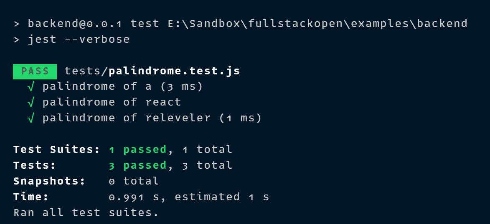
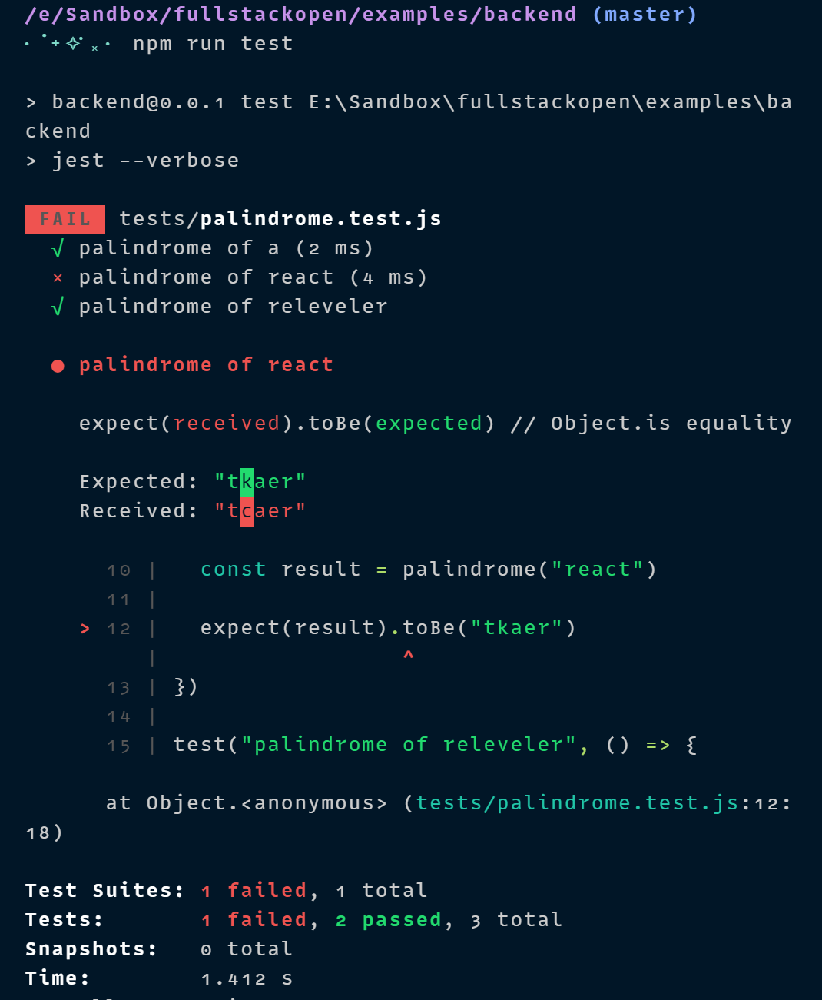
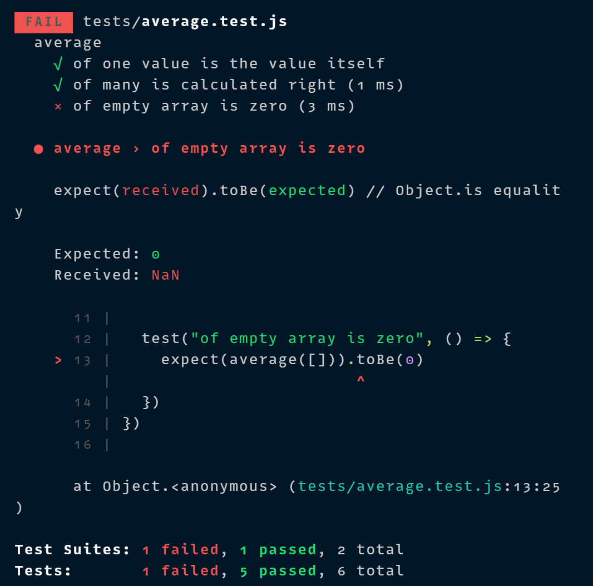
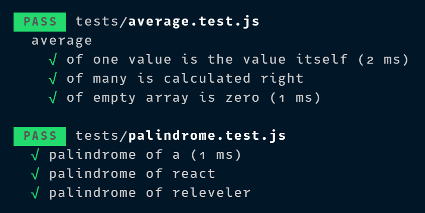

# Structure of Backend Application, Introduction to Testing

- [Structure of Backend Application, Introduction to Testing](#structure-of-backend-application-introduction-to-testing)
  - [Project Structure](#project-structure)
  - [Testing Node Applications](#testing-node-applications)

## Project Structure

Before we move into the topic of testing, we will modify the structure of our project to adhere to Node.js best practices.

After making the changes to the directory structure of our project, we end up with the following structure:

```
├── index.js
├── app.js
├── build
│   └── ...
├── controllers
│   └── notes.js
├── models
│   └── note.js
├── package-lock.json
├── package.json
├── utils
│   ├── config.js
│   ├── logger.js
│   └── middleware.js
```

Let's separate all printing to the console to its own module **_utils/logger.js_**

```js
const info = (...params) => {
  console.log(...params)
}

const error = (...params) => {
  console.error(...params)
}

module.exports = {
  info,
  error,
}
```

Extracting logging into its own module is a good idea in more ways than one. If we wanted to start writing logs to a file or send them to an external logging service like [graylog](https://www.graylog.org/) or [papertrail](https://papertrailapp.com/) we would only have to make changes in one place.

The content of the **_index.js_** file used for starting the app gets simplified as follows:

```js
const app = require("./app")
const http = require("http")
const config = require("./utils/config")
const logger = require("./utils/logger")

const server = http.createServer(app)

server.listen(config.PORT, () => {
  logger.info(`Server running on port ${config.PORT}`)
})
```

The **_index.js_** file only imports the actual application from the **_app.js_** file and then starts the application. The function **`info`** of the logger-module is used for the console printout telling that the application is running.

The handling of environment variables is extracted into a separate **_utils/config.js_** file

```js
const info = (...params) => {
  console.log(...params)
}

const error = (...params) => {
  console.error(...params)
}

module.exports = {
  info,
  error,
}
```

The other parts of the application can access the environment variables by importing the configuration module:

```js
const config = require("./utils/config")

logger.info(`Server running on port ${config.PORT}`)
```

The route handlers have also been moved into a dedicated module. The event handlers of routes aree commonly referred to as **_controllers_**, and for this reason we have created a new **_controllers_** directory. All of the routes related to notes are now in the **_notes.js_** module under the **_controllers_** directory.

The contents of the **_notes.js_** module are the following:

```js
const notesRouter = require("express").Router()
const Note = require("../models/note")

notesRouter.get("/", (req, res) => {
  Note.find({}).then((notes) => {
    res.json(notes)
  })
})

notesRouter.get("/:id", (req, res, next) => {
  Note.findById(req.params.id)
    .then((note) => {
      if (note) {
        res.json(note)
      } else {
        res.status(404).end()
      }
    })
    .catch((error) => next(error))
})

notesRouter.post("/", (req, res, next) => {
  const body = req.body

  const note = new Note({
    content: body.content,
    important: body.important || false,
    date: new Date(),
  })

  note
    .save()
    .then((savedNote) => savedNote.toJSON())
    .then((savedAndFormattedNote) => res.json(savedAndFormattedNote))
    .catch((error) => next(error))
})

notesRouter.delete("/:id", (req, res, next) => {
  Note.findByIdAndRemove(req.params.id)
    .then(() => {
      res.status(204).end()
    })
    .catch((error) => next(error))
})

notesRouter.put("/:id", (req, res, next) => {
  const body = req.body

  const note = {
    content: body.content,
    important: body.important,
  }

  Note.findByIdAndUpdate(req.params.id, note, { new: true })
    .then((updatedNote) => {
      res.json(updatedNote)
    })
    .catch((error) => next(error))
})

module.exports = notesRouter
```

At the beginning of the file we create a new router object:

```js
const notesRouter = require("express").Router()

// ...

module.exports = notesRouter
```

The module exports the router to be available for all consumers of the module.

All routes are now defined for the router object, in a similar fashion to what we had previouly done with the object representing the entire application.

It's worth noting that the paths in the route handlers have shortened. In the previous version, we had:

```js
app.delete("/api/notes/:id", (req, res) => {...})
```

And in the current version, we have:

```js
notesRouter.delete("/:id", (req, res) => {...})
```

So what are these router objects exactly? The Express manual provides the following explanation:

> A router object is an isolated instance of middleware and routes. You can think of it as a "mini-application", capable only of performing middleware and routing functions. Every Express application has a built-in app router.

The router is in face a **_middleware_**, that can be used for defining "related routes" in a single place, that is typically placed in its own module.

The **_app.js_** file that creates the actual application, takes the router into use as shown below:

```js
const notesRouter = require('./controllers/notes)
app.use("/api/notes", notesRouter)
```

After making these changes, our **_app.js_** file looks like this:

```js
const config = require("./utils/config")
const express = require("express")
const app = express()
const cors = require("cors")
const notesRouter = require("./controllers/notes")
const middleware = require("./utils/middleware")
const logger = require("./utils/logger")
const mongoose = require("mongoose")

logger.info("connecting to", config.MONGODB_URI)

mongoose
  .connect(config.MONGODB_URI, {
    useNewUrlParser: true,
    useUnifiedTopology: true,
    useFindAndModify: false,
    useCreateIndex: true,
  })
  .then(() => {
    logger.info("connected to MongoDB")
  })
  .catch((error) => {
    logger.error("error connecting to MongoDB: ", error.message)
  })

app.use(cors())
app.use(express.static("build"))
app.use(express.json())
app.use(middleware.requestLogger)

app.use("/api/notes", notesRouter)

app.use(middleware.unknownEndpoint)
app.use(middleware.errorHandler)

module.exports = app
```

The file takes different middleware into use, and one of these is the **_notesRouter_** that is attached to the **_/api/notes_** route.

Our custom middleware has been moved to a new **_utils/middleware.js_** module:

```js
const logger = require("./logger")

const requestLogger = (req, res, next) => {
  logger.info("Method: ", req.method)
  logger.info("Path: ", req.path)
  logger.info("Body: ", req.body)
  logger.info("---")
  next()
}

const unknownEndpoint = (req, res) => {
  res.status(404).send({ error: "unknown endpoint" })
}

const errorHandler = (error, req, res, next) => {
  logger.error(error.message)

  if (error.name === "CastError") {
    return res.status(400).send({ error: "malformatted id" })
  } else if (error.name === "ValidationError") {
    return res.status(400).json({ error: error.message })
  }

  next(error)
}

module.exports = {
  requestLogger,
  unknownEndpoint,
  errorHandler,
}
```

The responsibility of establishing the connection to the database has been given to the **_app.js_** module. The **_note.js_** file under the **_models_** directory only defines the Mongoose schema for notes.

```js
const mongoose = require("mongoose")

const noteSchema = new mongoose.Schema({
  content: {
    type: String,
    minLength: 5,
    required: true,
  },
  date: {
    type: Date,
    required: true,
  },
  important: Boolean,
})

noteSchema.set("toJSON", {
  transform: (document, returnedObject) => {
    returnedObject.id = returnedObject._id.toString()
    delete returnedObject._id
    delete returnedObject.__v
  },
})

module.exports = mongoose.model("Note", noteSchema)
```

To recap, the directory structure loooks like this after the changes have been made:

```
├── index.js
├── app.js
├── build
│   └── ...
├── controllers
│   └── notes.js
├── models
│   └── note.js
├── package-lock.json
├── package.json
├── utils
│   ├── config.js
│   ├── logger.js
│   └── middleware.js
```

There is no strict directory structure or file naming convention that is required for Express applications. To contrast this, Ruby on Rails does require a specific structure. Our current structure simply follows some of the best practices you can come accross on the internet.

## Testing Node Applications

Let's start our testing journey by looking at unit tests. The logic of our app is so simple that there is not much that makes sense to test with unit tests. Let's create a new file **_utils/for_testing.js_** and write a couple of simple function that we can use for test writing practice:

```js
const palindrome = (string) => {
  return string.split("").reverse().join("")
}

const average = (array) => {
  const reducer = (sum, item) => {
    return sum + item
  }

  return array.reduce(reducer, 0) / array.length
}

module.exports = {
  palindrome,
  average,
}
```

The **`average`** function uses the array [reduce](https://developer.mozilla.org/en-US/docs/Web/JavaScript/Reference/Global_Objects/Array/Reduce) method.

There are many different libraries or **_test runners_** for JavaScript. In this course we will be using a testing library developed and used internally by Facebook called [jest](https://jestjs.io/), that resembles the previous king of JS testing libraries [Mocha](https://mochajs.org/). Other alternatives do exist, like [ava](https://github.com/avajs/ava) that has gained popularity in some circles.

Jest works well for testing backends, and it shiines when it comes to testing React applications.

> **Windows users:** Jest may not work if the path of the project directory contains a directory that has spaces in its name.

Since tests are only executed during the development of our app, we will install **_jest_** as a development dependency with the command:

```bash
npm install --save-dev jest
```

Let's define the npm script **`test`** to execute tests with Jest and to report about the test execution with the **_verbose_** style:

```json
{
  // ...
  "scripts": {
    "start": "node index.js",
    "dev": "nodemon index.js",
    "lint": "eslint .",
    "build:ui": "rm -rf build && cd ../notes && npm run build && cp -r build ../backend/",
    "deploy": "git push heroku master",
    "deploy:full": "npm run build:ui && git add . && git commit -m uibuild && npm run deploy",
    "logs:prod": "heroku logs --tail",
    "test": "jest --verbose"
  },
  // ...
}
```

Jest requires one to specify that the execution environment is Node. This can be done by adding the following to the end of **_package.json_**:

```json
{
  // ...
  "jest": {
    "testEnvironment": "node"
  }
}
```

Alternatively, Jest can loook for a configuration file with the default name **_jest.config.js_**, where we can define the execution environment like this:

```js
module.exports = {
  testEnvrironment: "node"
}
```

Let's create a separate directory for our tests called **_tests_** and create a new file called **_palindrome.test.js_** with the following contents:

```js
const palindrome = require("../utils/for_testing").palindrome

test("palindrome of a", () => {
  const result = palindrome("a")

  expect(result).toBe("a")
})

test("palindrome of react", () => {
  const result = palindrome("react")

  expect(result).toBe("tcaer")
})

test("palindrome of releveler", () => {
  const result = palindrome("releveleler")

  expect(result).toBe("releveler")
})
```

The ESLint configuration we added to the project in the previous complains about the **`test`** and **`expect`** commands in our test file, since the configuration does not allow **_globals_**. Let's get rid of the complaints by adding **`"jest": true`** to the **_env_** property in the **_.eslintrc.js_** file.

```js
module.exports = {
  "env": {
    "commonjs": true,
    "es6": true,
    "node": true,
    "jest": true,
  },
  "extends": "eslint:recommended",
  "rules": {
    // ...
  },
}
```

In the first row, the test file imports the function to be tested and assigns it to a variable called **`palindrome`**:

```js
const palindrome = require("../utils/for_testing").palindrome
```

Individual test cases are defined with the **`test`** function. The first parameter of the function is the test description as a string. The second parameter is a **_function_**, that defines the functionality for the test case. The functionality for the second test case looks like this:

```js
() => {
  const result = palindrome("react")

  expect(result).toBe("tcaer")
}
```

First we execute the code to be tested, meaning that we generate a plaindrome for the string **_react_**. Next we verify the results with the [expect](https://facebook.github.io/jest/docs/en/expect.html#content) function. Expect wraps the resulting value into an object that offers a collection of a **_matcher_** functions, that can be used for verifying the correctness of the result. Since in this test case we are comparing two strings, we can use the [toBe](https://facebook.github.io/jest/docs/en/expect.html#tobevalue) matcher.

As expected, all of the tests pass:



Jest expects by default that the names of test files contain **_.test_**. In this course, we will follow the convention of naming our tests files with the extension **_.test.js_**.

Jest has excellent error messages, let's break the test to demonstrate this:

```js
test("palindrome of react", () => {
  const result = palindrome("react")

  expect(result).toBe("tkaer")
})
```

Running the tests above results in the following error message:



Let's add a few tests for the **`average`** function, into a new file **_tests/average.test.js_**.

```js
const average = require("../utils/for_testing").average

describe("average", () => {
  test("of one value is the value itself", () => {
    expect(average([1])).toBe(1)
  })

  test("of many is calculated right", () => {
    expect(average([1, 2, 3, 4, 5, 6])).toBe(3.5)
  })

  test("of empty array is zero", () => {
    expect(average([])).toBe(0)
  })
})
```

The test reveals that the function does not work correctly with an empty array (this is because in JavaScript dividing by zero results in **_NaN_**):



Fixing the function is quite easy:

```js
const average = array => {
  const reducer = (sum, item) => {
    return sum + item
  }

  return array.length === 0 ? 0 : array.reduce(reducer, 0) / array.length
}
```

If the length of the array is **`0`** then we return **`0`**, and in all other cases we use the **`reduce`** method to calculate the average.

There are a few things to notice about the tests that we just wrote. We defined a **_describe_** block around the tests that was given the name **`average`**:

```js
describe("average", () => {
  // tests
})
```

Describe blocks can be used for grouping tests into logical collections. The test output of Jest also uses the name of the describe block:



As we'll see later on **_describe_** blocks are necessary when we want to run some shared setup or teardown operations for a group tests.

Another thing to notice is that we wrote the tests in quite a compact way, without assigning the output of the function being tested to a variable:

```js
test("of empty array is zero", () => {
  expect(averate([])).toBe(0)
})
```

You can run a single test with the only method:

```js
test.only('it is raining', () => {
  expect(inchesOfRain()).toBeGreaterThan(0);
});

test('it is not snowing', () => {
  expect(inchesOfSnow()).toBe(0);
});
```

Only the **`"it is raining"`** test will run

Another way of running a single test (or describe block) is to specify the name of the test to be run with the **`-t`** flag:

```bash
npm test -- -t "when list has only one blog, equals the likes of that"
```
